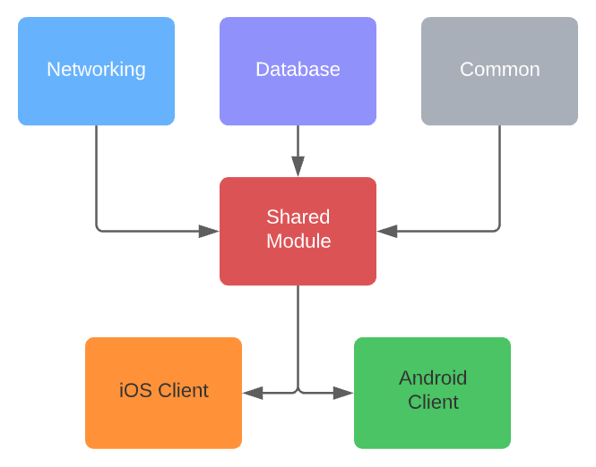

 

    

<h3 align="left">Kotlin Multiplatform Mobile - Modular Project Example</h3>

---

#### Overview

The standard KMM project template created in Android Studio consists of a single shared module, an iOS client project, and an Android client project. This is a great way to get started using KMM, but depending on your project needs, could become cumbersome to maintain as your project grows in size and complexity.

This repo is a sandbox for me to experiment with using a modular approach, which follows an 'umbrella structure' consisting of a single point of reference for our client projects (i.e. the shared module), with separate submodules for networking, database, utilities and features:

    

#### But why?
There are a lot of benefits to this approach, including:

1. **Manageability** - Having a project separated into smaller pieces allows for easier management as complexity increases. The separate modules enable developers to work on the project in parallel. In addition, modules can be loaded / unloaded as needed.  

2. **Extendability** - It's much easier and cleaner to create a new submodule to support a new feature, as opposed to implementing it within an individual application. As requirements change, having an independent module allows for much more flexibility.

3. **Testing and Errors** - Having functionality isolated means we can also test and identify errors on the module level, which simplifies fault detection and reduces risk.

4. **Reuse** - The submodules can easily be reused as a dependency in another project if business or product needs change.

#### Plans
This is an ongoing work in progress, but I plan on adding example code for the following:

1. Networking example with Ktor.  
2. Local persistence example with Realm.  
3. Testing and CI examples.
4. Publishing as a consumable library.
